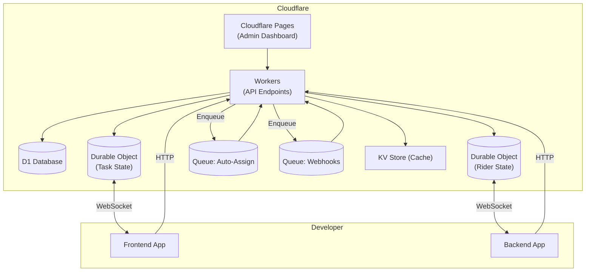

# FleetCore API — Executive Summary & Integration Guide

## A. Simplified Overview for Non-Technical Stakeholders

**What is FleetCore?**

* A plug-and-play backend service that powers delivery, field service, and on-demand apps.
* Developers subscribe and integrate our APIs; they never build routing, task dispatch, or live‑tracking themselves.
* Our platform handles security, scalability, real‑time updates, and billing.

**Key Benefits**

* **Speed to Market**: Launch a logistics service in days, not months.
* **Cost Efficiency**: Pay only for what you use—no infrastructure overhead.
* **Reliability**: Backed by Cloudflare’s global network for <50ms response times.
* **Flexibility**: Configure automatic or manual dispatch, geofenced zones, and rich analytics.

**High-Level Process**

1. **Sign Up**: Developer creates account and gets API credentials.
2. **Register Riders**: Add delivery agents and specify vehicle types.
3. **Create Tasks**: Post job details (pickup/dropoff) via simple API call.
4. **Assign/Auto-Assign**: Platform finds the best rider or you choose manually.
5. **Track Live**: Real-time map integration shows rider location and status.
6. **Billing & Metrics**: Usage dashboard displays cost and performance analytics.

---

## B. Sample Frontend & Backend Integration

### Backend (Node.js / Express)

```javascript
const express = require('express');
const axios = require('axios');
const app = express();
app.use(express.json());
const API = axios.create({ baseURL: 'https://api.fleetcore.dev/v1', headers: { 'X-Api-Key': process.env.FLEETCORE_KEY }});

// 1. Create a task\app.post('/tasks', async (req, res) => {
  const payload = {
    description: 'Deliver document',
    auto_assign: true,
    waypoints: [
      { latitude: 6.52, longitude: 3.37, address: 'Warehouse Lagos', type: 'pickup', description: 'Pickup docs' },
      { latitude: 6.60, longitude: 3.35, address: 'Client Office', type: 'destination', description: 'Drop off docs' }
    ]
  };
  const response = await API.post('/tasks', payload);
  res.json(response.data);
});

// 2. Listen to real-time updates via WebSocket
const WebSocket = require('ws');
const ws = new WebSocket('wss://api.fleetcore.dev/v1/tasks/{taskId}/realtime?api_key=' + process.env.FLEETCORE_KEY);
ws.on('message', msg => console.log('Update:', msg));

app.listen(3000);
```

### Frontend (React)

```jsx
import React, { useEffect, useState } from 'react';

export function TaskTracker({ taskId, apiKey }) {
  const [updates, setUpdates] = useState([]);

  useEffect(() => {
    const ws = new WebSocket(
      `wss://api.fleetcore.dev/v1/tasks/${taskId}/realtime?api_key=${apiKey}`
    );
    ws.onmessage = evt => setUpdates(u => [...u, JSON.parse(evt.data)]);
    return () => ws.close();
  }, [taskId, apiKey]);

  return (
    <ul>
      {updates.map((u,i) => <li key={i}>{u.status} at {u.timestamp}</li>)}
    </ul>
  );
}
```

---

## C. Visual System Architecture



*Legend*:

* Workers handle REST routes and enqueue async jobs.
* D1 stores persistent data.
* Durable Objects manage real-time channels.
* Queues decouple auto-assignment and webhook delivery.
* KV for fast lookups and caching.

---

Enjoy building with FleetCore!
